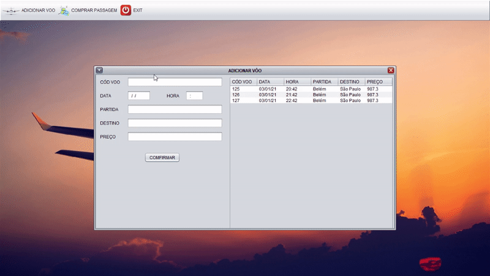
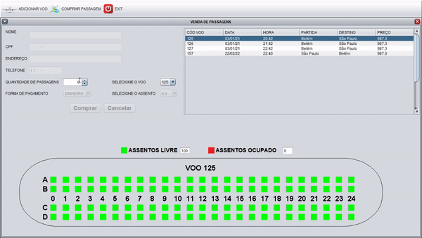

# AeroPorto

Projeto final da disciplina de programação 2 em java.

Sistema simples de um aeroporto com adição de voos com interface gráfica e venda de passagens.

Representação grafica dos assentos dos voos de forma individual aonde cada voo possuem seus assentos.

  

  

